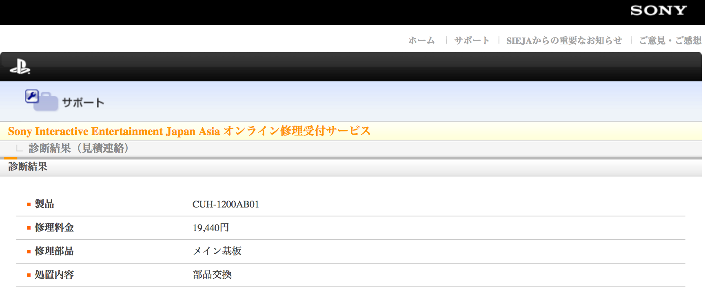

# TL;DR

- 修理は見送り
- 気が向いたらスリムを買い直す（4K テレビを買う予定がない）

## 言われてみれば PlayStation は初破損

- 購入したのは Bloodborne 発売次期だったはずなので 2015 年春頃
  - ちょうど 2 年目で破損
- PS1 から PS4 までなんだかんだ買っていたが壊れたのは初めて
- 最後に壊したハードは Xbox360 アーケードだった記憶
- PS4 でプレイしたもの
  - Overwatch
  - Dark Souls 3
  - Bloodborne
- 積み
  - BIOHAZARD7
  - Bloodborne DLC

## 次買うなら

- とりあえずスタンバイ起動でのアップデートはやめる
- 過去の経験的に 3 年ぐらいは保証されたい
