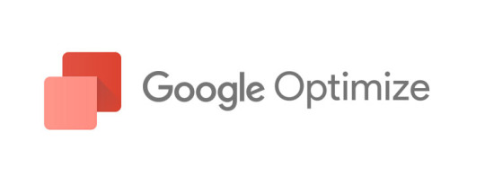

# TL;DR

- google optimize で今適応されているテストは何か調べた
- テストの結果は first party cookie
- `_gaexp`という名前で記録されている
- **規約は読んで自己責任で参照しましょう**



## 軽く調べた結果

- [公開情報](https://developers.google.com/analytics/devguides/collection/analyticsjs/cookie-usage?hl=en#optimize)
  - `_gaexp`という名前で記録されている
  - cookie はデフォルト 90 日保存

## おそらく操作しているところ

- `m[0]` は `experimentid`
- `m[2]` がテストのパターンを表している
  - cookie の一番最後の number
  - これだけだと `variationid` としては使えないので何かと複合してユニークになっている
- `m[1]` は number だが何の値かはすぐにはわからなかった

```js
Zg = function (a, b) {
  const c = b.match(/GAX1\.([^.]+).(.*)/)
  if (c) {
    let d
    a: {
      const e = (c[1] || '').split('-')
      if (!(e.length == 0 || e.length > 2)) {
        const f = ia(e[0])
        if (f.length != 0) {
          const g = e.length == 2 ? ia(e[1]) : '1'
          if (uf(f) && uf(g)) {
            d = new Og(T(f), T(g))
            break a
          }
        }
      }
      d = void 0
    }
    if (d) {
      for (
        var h = new Qg(d, a.qa, a.ha), k = (c[2] || '').split('!'), l = 0;
        l < k.length;
        l++
      ) {
        const m = k[l].split('.')
        if (m.length == 3) {
          if (!uf(m[1])) {
            return
          }
          Ug(h, m[0], new Pg(m[2], T(m[1])))
        }
      }
      return h
    }
  }
}
```

## Extra

- [stackoverflow](https://stackoverflow.com/questions/44412241/is-it-possible-to-read-experimentid-and-variationid-in-javascript-with-google-op)
  - AB テストとして JavaScript が実行できるので、自分でユニークな ID を配信して実行されているテストを特定しましょう
  - リバースエンジニアリングして危ない道を渡るよりも現実的
  - ちゃんと AB テストの記録は計測できます、そう google analytics ならね！

Happy Hacking!
