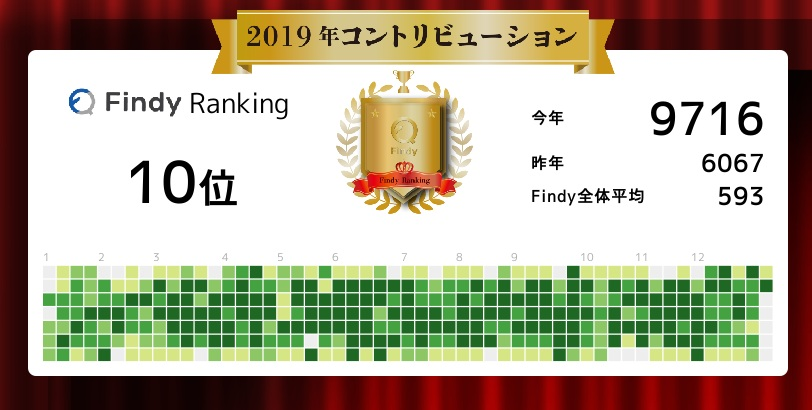

# TL;DR

- [findy-code](https://findy-code.io/)で 10 位だったそうです (昨年 25 位）
- [スキルは変更を図っていますが](https://9renpoto.dev/2019/12/08/next-stack/)、スキル値はまったく変動なし
- GraphQL とアプリを書きたい

## 芝生

- スキルの変更を図ってることもあり昨年よりは温かい

## 振り返り

    - 無職でしたが、年明けより新しいお仕事をいただくことなりました

ありがたいことに現在の職場で技術的な観点では挑戦も含めて働くことができています。

    - とりあえず、まだフリーランスを継続することになりましたので、確定申告がんばります

今年も確定申告を迎えることに。

    - publicな環境で運用されるプロダクトを作りたい。偏差値を上げたい。仕事がなくなる

偏差値は全く変化せず、マネジメント経験を入力すると findy 内の想定年収は上がった。.。

## 来年

- 親知らずを処理する
- 全く未着手なスキルを減らす（アプリ、インフラ）
- 部屋が手狭で辛いので何らかの手を打つ

## 過去

- [2018 年終わり](https://9renpoto.dev/2018/12/31/2018-end/)
- [2017 年終わり](https://9renpoto.dev/2017/12/31/2017-end/)
- [2016 年終わり](https://9renpoto.dev/2017/01/01/2016/)
