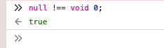

泣いた



refs: https://github.com/facebook/jest/blob/v26.0.1/packages/expect/src/matchers.ts#L196-L212

```ts
  toBeDefined(this: MatcherState, received: unknown, expected: void) {
    const matcherName = 'toBeDefined';
    const options: MatcherHintOptions = {
      isNot: this.isNot,
      promise: this.promise,
    };
    ensureNoExpected(expected, matcherName, options);

    const pass = received !== void 0;

    const message = () =>
      matcherHint(matcherName, undefined, '', options) +
      '\n\n' +
      `Received: ${printReceived(received)}`;

    return {message, pass};
  },
```
